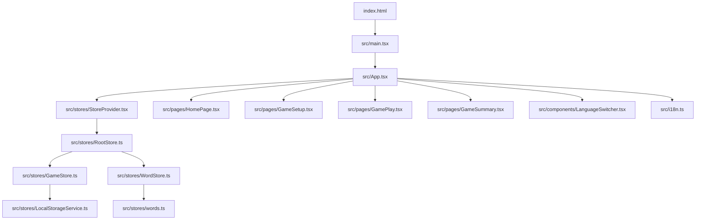

# File Map - Dependencies and Relationships

## Entry Point Chain
```
index.html → src/main.tsx → src/App.tsx → [Page Components]
```

## Core Application Flow


## File Import Dependencies

### `src/main.tsx` (Entry Point)
```typescript
// Imports:
import React from 'react'
import { createRoot } from 'react-dom/client'
import App from './App.tsx'
import './index.css'

// Dependencies: React, React-DOM, App component, global styles
// Used by: index.html (script tag)
```

### `src/App.tsx` (Main Component)
```typescript
// Imports:
import { HashRouter, Routes, Route } from 'react-router-dom'
import { MantineProvider, createTheme } from '@mantine/core'
import { Suspense } from 'react'
import { useTranslation } from 'react-i18next'

// Page imports (lazy loaded):
const HomePage = lazy(() => import('./pages/HomePage'))
const GameSetup = lazy(() => import('./pages/GameSetup'))
const GamePlay = lazy(() => import('./pages/GamePlay'))
const GameSummary = lazy(() => import('./pages/GameSummary'))

// Component imports:
import StoreProvider from './stores/StoreProvider'
import LanguageSwitcher from './components/LanguageSwitcher'
import InstallPrompt from './components/InstallPrompt'
import './i18n'

// Dependencies: React Router, Mantine, i18next, all page components, stores
// Used by: main.tsx
```

### `src/stores/StoreProvider.tsx`
```typescript
// Imports:
import React, { createContext, useContext, useState, useEffect } from 'react'
import { autorun } from 'mobx'
import RootStore from './RootStore'
import LocalStorageService from './LocalStorageService'

// Dependencies: React, MobX, RootStore, LocalStorageService
// Used by: App.tsx
// Provides: Store context to all child components
```

### `src/stores/RootStore.ts`
```typescript
// Imports:
import GameStore from './GameStore'
import WordStore from './WordStore'

// Dependencies: GameStore, WordStore
// Used by: StoreProvider.tsx
// Provides: Centralized store access
```

### `src/stores/GameStore.ts`
```typescript
// Imports:
import { makeAutoObservable, runInAction } from 'mobx'
import { Game, Team, Round } from '../types'
import LocalStorageService from './LocalStorageService'

// Dependencies: MobX, TypeScript types, LocalStorageService
// Used by: RootStore.ts, all game-related components
// Manages: Game state, rounds, scoring, timer
```

### `src/stores/WordStore.ts`
```typescript
// Imports:
import { makeAutoObservable } from 'mobx'
import { Word } from '../types'
import { words as wordDatabase } from './words'

// Dependencies: MobX, TypeScript types, word database
// Used by: RootStore.ts, GamePlay component
// Manages: Word selection, filtering, current word state
```

### `src/stores/LocalStorageService.ts`
```typescript
// Imports:
import { Game } from '../types'

// Dependencies: TypeScript types only
// Used by: GameStore.ts, StoreProvider.tsx
// Manages: Persistence to browser localStorage
```

### `src/types/index.ts`
```typescript
// No imports - pure type definitions
// Used by: All stores, all components that need type safety
// Provides: Core interfaces (Game, Team, Word, Round)
```

## Page Component Dependencies

### `src/pages/HomePage.tsx`
```typescript
// Imports:
import { useNavigate } from 'react-router-dom'
import { useTranslation } from 'react-i18next'
import { Container, Title, Text, Button, Grid, Card, ThemeIcon } from '@mantine/core'
import { IconUsers, IconClock, IconTrophy } from '@tabler/icons-react'

// Dependencies: React Router, i18next, Mantine UI, Tabler icons
// Used by: App.tsx routing
// Provides: Landing page with game introduction
```

### `src/pages/GameSetup.tsx`
```typescript
// Imports:
import { useState, useCallback } from 'react'
import { useNavigate } from 'react-router-dom'
import { useTranslation } from 'react-i18next'
import { observer } from 'mobx-react-lite'
import { useStores } from '../stores/StoreProvider'
import Mantine components...

// Dependencies: React, React Router, i18next, MobX, Mantine, stores
// Used by: App.tsx routing
// Provides: Team setup and game configuration
```

### `src/pages/GamePlay.tsx`
```typescript
// Imports:
import { useState, useEffect, useCallback } from 'react'
import { useParams, useNavigate } from 'react-router-dom'
import { useTranslation } from 'react-i18next'
import { observer } from 'mobx-react-lite'
import { useStores } from '../stores/StoreProvider'
import Mantine components...

// Dependencies: React, React Router, i18next, MobX, Mantine, stores
// Used by: App.tsx routing
// Provides: Core gameplay interface with timer and word management
```

### `src/pages/GameSummary.tsx`
```typescript
// Imports:
import { useParams, useNavigate } from 'react-router-dom'
import { useTranslation } from 'react-i18next'
import { observer } from 'mobx-react-lite'
import { useStores } from '../stores/StoreProvider'
import Mantine components...

// Dependencies: React Router, i18next, MobX, Mantine, stores
// Used by: App.tsx routing
// Provides: Game results and statistics display
```

## Component Dependencies

### `src/components/LanguageSwitcher.tsx`
```typescript
// Imports:
import { Select } from '@mantine/core'
import { useTranslation } from 'react-i18next'

// Dependencies: Mantine UI, i18next
// Used by: App.tsx
// Provides: Language selection dropdown
```

### `src/components/InstallPrompt.tsx`
```typescript
// Imports:
import { useState, useEffect } from 'react'
import { Button, Text, Group } from '@mantine/core'
import { useTranslation } from 'react-i18next'

// Dependencies: React, Mantine UI, i18next
// Used by: App.tsx
// Provides: PWA installation prompt
```

### `src/components/RouteTransition.tsx`
```typescript
// Imports:
import { ReactNode } from 'react'
import { Transition } from '@mantine/core'

// Dependencies: React, Mantine UI
// Used by: App.tsx for page transitions
// Provides: Animated route transitions
```

## Internationalization Dependencies

### `src/i18n.ts`
```typescript
// Imports:
import i18n from 'i18next'
import { initReactI18next } from 'react-i18next'
import LanguageDetector from 'i18next-browser-languagedetector'

// Translation imports (dynamic):
import('./locales/en/common.json')
import('./locales/ru/common.json')
// ... other namespaces

// Dependencies: i18next, react-i18next, browser language detector, translation files
// Used by: App.tsx (imported for side effects)
// Provides: Internationalization configuration
```

### Translation Files (`src/locales/[lang]/[namespace].json`)
```
src/locales/
├── en/
│   ├── common.json     # Used by: All components
│   ├── home.json       # Used by: HomePage.tsx
│   ├── setup.json      # Used by: GameSetup.tsx
│   ├── game.json       # Used by: GamePlay.tsx
│   └── summary.json    # Used by: GameSummary.tsx
└── ru/ (same structure)
```

## Configuration File Dependencies

### `vite.config.ts`
```typescript
// Imports:
import { defineConfig } from 'vite'
import react from '@vitejs/plugin-react-swc'

// Dependencies: Vite, React SWC plugin
// Used by: Vite build system
// Configures: Build optimization, chunking strategy, dev server
```

### `package.json`
```json
// No imports - configuration file
// Used by: npm, build tools, IDE
// Defines: Dependencies, scripts, project metadata
```

### TypeScript Configuration Files
```
tsconfig.json           # Base TypeScript configuration
├── tsconfig.app.json   # App-specific TypeScript settings
└── tsconfig.node.json  # Node.js tools TypeScript settings
```

## Build System Dependencies
```
Vite Build Process:
├── vite.config.ts → Build configuration
├── src/main.tsx → Entry point
├── index.html → HTML template
└── Output → dist/ directory
    ├── index.html (with optimized spinner)
    ├── assets/
    │   ├── react-ui.[hash].js     # React + Mantine chunk
    │   ├── mobx.[hash].js         # MobX chunk
    │   ├── i18n.[hash].js         # i18next chunk
    │   ├── icons.[hash].js        # Icons chunk
    │   └── [component].[hash].js  # Individual component chunks
    └── Translation files loaded dynamically
```

## Store Communication Patterns
```
StoreProvider (Context)
├── Provides RootStore to all components
├── Sets up autorun for localStorage persistence
└── Cleanup on unmount

Component → Store Communication:
├── useStores() hook → Access to all stores
├── MobX observer → Automatic re-rendering
├── Store actions → State mutations
└── Store computed → Derived values
```

## Data Flow Patterns
```
User Action → Component → Store Action → State Change → UI Update
     ↓
localStorage ← LocalStorageService ← MobX autorun ← Store state
```

## Critical File Relationships

### Most Important Files for Understanding the App:
1. `src/types/index.ts` - Data structures
2. `src/stores/GameStore.ts` - Core game logic
3. `src/stores/WordStore.ts` - Word management
4. `src/pages/GamePlay.tsx` - Main gameplay
5. `src/App.tsx` - Application structure
6. `vite.config.ts` - Build optimization

### Files That Import the Most Dependencies:
1. `src/App.tsx` - Routing, theme, stores, i18n, all major libraries
2. `src/pages/GamePlay.tsx` - Most complex component with many features
3. `src/stores/GameStore.ts` - Core business logic with many interactions
4. `src/i18n.ts` - Internationalization setup with dynamic imports

### Files That Are Imported the Most:
1. `src/types/index.ts` - Used by all stores and most components
2. `src/stores/StoreProvider.tsx` - Used by App.tsx and provides context
3. `src/stores/GameStore.ts` - Used by all game-related components
4. Translation files - Used by all components with text content 

## src/App.tsx Dependencies
**Imports:**
- `@mantine/core` → MantineProvider, AppShell, Title, Text, Flex, Container
- `react-router-dom` → HashRouter, Routes, Route, useLocation
- `react-i18next` → useTranslation
- `./components/RouteTransition` → RouteTransition
- `./components/InstallPrompt` → InstallPrompt
- `./components/LanguageSwitcher` → LanguageSwitcher
- `./stores/StoreProvider` → StoreProvider
- `./pages/HomePage` → HomePage
- `./pages/GameSetup` → GameSetup
- `./pages/GamePlay` → GamePlay
- `./pages/GameSummary` → GameSummary
- `./theme` → theme

**Used by:**
- `src/main.tsx` (imports App as default)

## src/theme.ts Dependencies
**Imports:**
- `@mantine/core` → createTheme, rem

**Used by:**
- `src/App.tsx` (imports theme) 